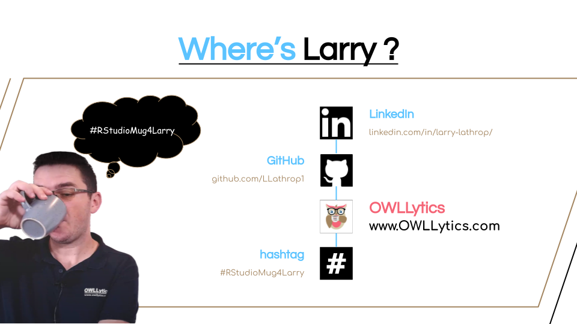

```{r setup, include=FALSE}
knitr::opts_chunk$set(echo = TRUE, warning = FALSE, message = FALSE)
```

# {.tabset}

## Masking Data

Using the Noah package (by Tobias Busch) allows you to create a portfolio without disclosing any **TOP SECRET** information. The Noah package creates pseudonyms with hilarious animal names! 

As a freelancer, I work with sensitive information all the time. And I also know that my portfolio is very important in generating new leads. This becomes problematic when clients do not want to have their super-duper top-secret data shared with others. This breaks the trust and integrity of a freelancer if they just share the juice for the world to see.  

*Not a good idea!*

But, you can mask the data easily with pseudonyms. This hides, the critical information while showcasing your findings for your portfolio.

Let's take a look at how this works.


## The Packages
```{r packages,  results="hide"}
#install.packages(c("tidyverse", "noah"))

library(tidyverse)
library(noah)
library(plotly)
library(DT)       
```


We load up the *tidyverse* to help with tidy data. And the noah package to create an amazing animal mask for data. WE will also add ploty to make our ggplots a little more dynamic and the DT to create dynamic tables
<p align="center">

</p>

## Loading The Data
```{r data}
df <- read.csv("Demo Data.csv", stringsAsFactors = FALSE)

datatable(
  df,
  options =  list(pageLength = 5,
                  scrollX = T),
  rownames = FALSE
)

```
Taking a glance at this sample eCommerce data, we can see that we have some **Critical** information. 

* order.id
* sku
* description
* marketplace
* product.sales
* selling.fees
* fba.fees

These are some of the data points that clients may not want you to share with the world. And with that, you can say "Well I can't put this in my portfolio, now what?"

**WRONG**

Just mask these data points. Easily!

## Hiding Data

The function we are going to use is *pseudonymize()* from the Noah package. 

```{r masking}
pseudonymize(df$sku)[1:10]
```
As you can see the SKU field has now magically turned into superhero animals (well if they had superhero names)

Next let's clean up the data and put this in a data frame!

```{r}
mask_df<-
df%>%
  
  mutate(fake.sku = pseudonymize(sku),                                           #adding the animal names
         Sales = as.numeric(gsub("\\$","",product.sales)),                       #Cleaning up sales number
         date = format(as.Date(df$date.time, "%b %d, %Y"), "%d %B %Y"),          #Cleaning the date format
         fees = as.numeric(gsub("\\$","", fba.fees)) + 
                as.numeric(gsub("\\$","",selling.fees)) +
                as.numeric(gsub("\\$","",other.transaction.fees)),               #Combining fee data together
         profit = Sales + fees)%>%                                               #Getting the profit
   select(date, 
          sku,
          fake.sku, 
          Sales, 
          fees,
          profit,
          order.city,
          order.state)                                                           #Selecting only the necessary data

datatable(mask_df,
  options = list(pageLength = 5),
  rownames = FALSE)
```

As you can see in the table above, we have now made an animal ask for our SKU data. Que the "What does the fox say song".  Each SKU gets its superhero (or supervillain) animal name. With no repeats. 

This is perfect for hiding important information while allowing us to showcase our project for our portfolio.

## Plotting Time

Let's take this one step further and make some charts! 

```{r plot1}
p1<-
ggplot(mask_df%>%
         group_by(sku,fake.sku)%>%
         summarise(Sales = sum(Sales),
                   fees = sum(fees),
                   profit = Sales + fees,
                   margin = profit / Sales)%>%
         arrange(desc(margin))%>%
         head(10),
       aes(x = fake.sku, y = profit))+
  geom_col(fill = "#A38560")+
  coord_flip()+
theme_bw()

ggplotly(p1)

datatable(
  mask_df%>%
         group_by(sku,fake.sku)%>%
         summarise(Sales = sum(Sales),
                   fees = sum(fees),
                   profit = Sales + fees,
                   margin = profit / Sales)%>%
         arrange(desc(margin))%>%
         head(10),
  rownames = FALSE
)

```

In the plot above, we are looking at the top 10 SKUs based on profit margin but looking over the total profit each SKU has given the client. At the time of writing this, *Capable Duck* provides the most profits in our top 10 profit margin.

Now this chart has masked the important information. All we need to do is make a full portfolio and share it with the world. And we are not sharing any of the clients **IP** for the public to view. 

Now when we share our portfolio, we can explain, share, and show what we did for previous clients with ease.  


## Where's Larry

